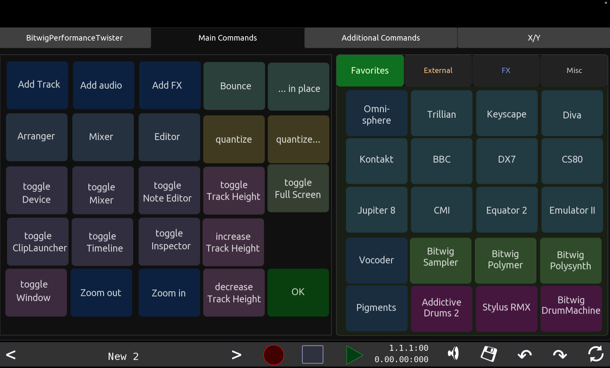
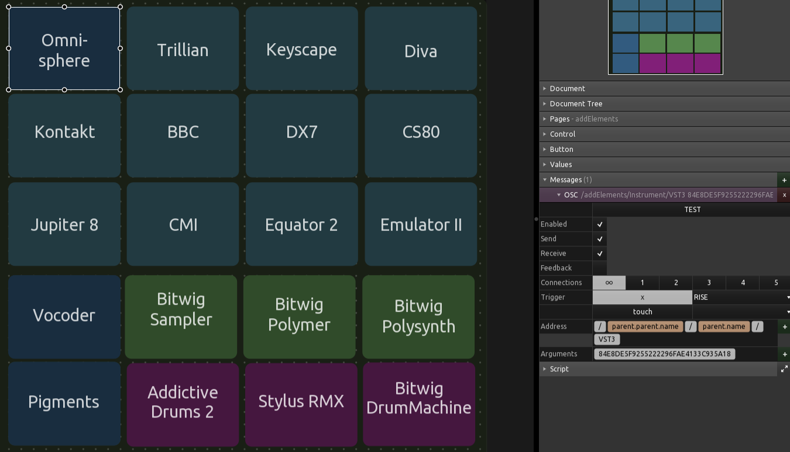
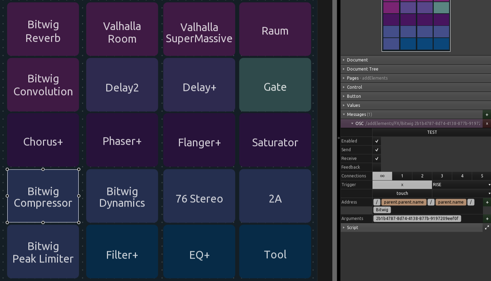
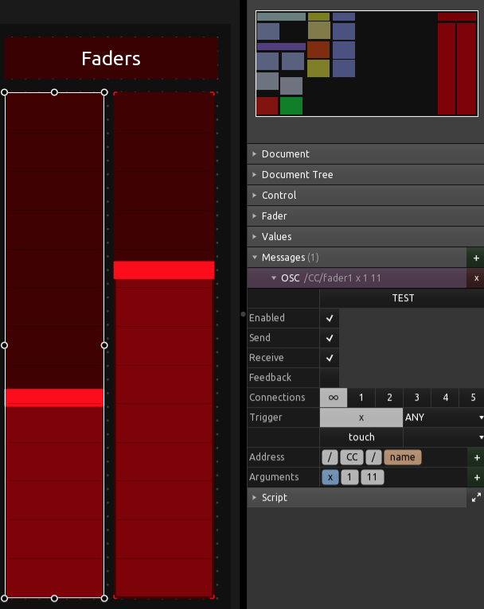
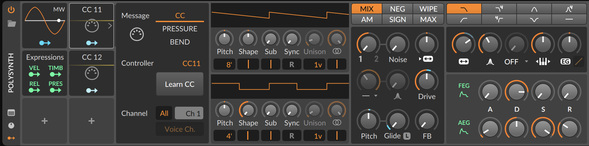
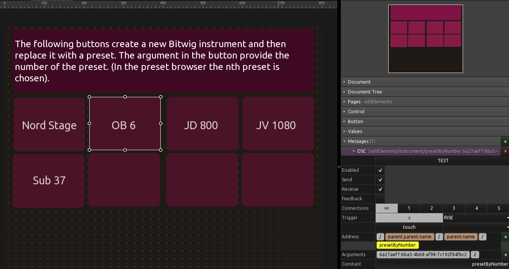
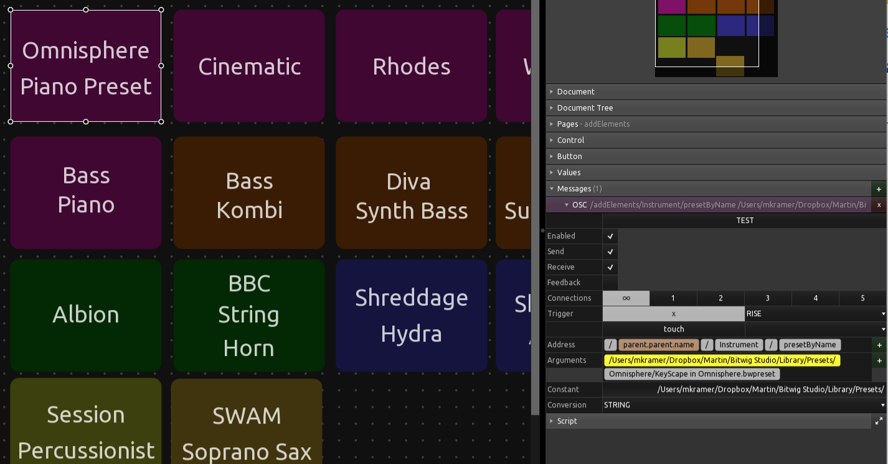
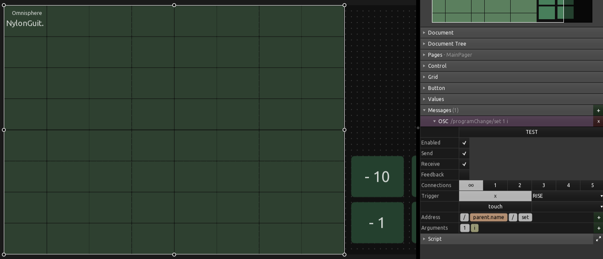
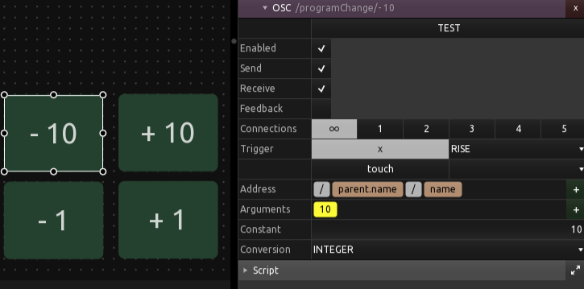

# Bitwig Performance Twister - OSC Extension<!-- omit in toc -->

This is an extended description of the OSC extension to Bitwig Performance Twister. Please go [here](./README.md) for the general description of what Bitwig Performance Twister can do for you. 
  

## Table of Contents <!-- omit in toc -->
1. [Introduction to the OSC extension](#introduction)
    1. [OSC Use Cases](#osc-use-cases)
2. [The TouchOSC Surface](#the-touchosc-surface) 
3. [Available OSC Messages](#available-osc-messages)
    1. [Tables of Bitwig Performance Twister OSC Messages](#tables-of-bitwig-performance-twister-osc-messages)
    1. [Adding Instruments and Effects](#adding-instruments-and-effects)
    1. [The XY element](#the-xy-element)
    1. [Access to the Bitwig Commands](#access-to-the-bitwig-commands)
4.  [Further Examples of Commands](#further-examples-of-commands)
5. [Extended Configuration for using OSC](#extended-configuration-for-using-osc)
6. [OSC Installation in TouchOSC](#osc-installation-in-touchosc)

      
## Introduction
Bitwig Performance Twister is an extension for the DAW Bitwig to use the Midi controller "Midi Fighter Twister". I have added additional (optional) functionality to this script so 
that you can see what you are controlling with the Midi controller. You can use a any OSC capable device, that could be an iPad which is running TouchOSC, for instance. And that is 
exactly the setup I am using (and also the only OSC setup which I have tested). 
With the OSC extension you are able to 
* see the functionality of the Midi Fighter Twister, e.g. see on the OSC surface which encoder is controlling which parameter in Bitwig
* see which of the six modes you are currently in
* add additional controls which send and receive OSC messages
* add command buttons to trigger actions in Bitwig
* use the full OSC implementation provided by the Bitwig extension *Driven by Moss* 

### OSC Use Cases 
I am using the OSC extension mainly for three distinct use cases: 
1. Having a label of the MFT encoder directly places above the Midi Fighter Twister to quickly see the current mode and quickly find the not so often used features
2. Have short cut buttons on the tablet to trigger off actions in Bitwig, e.g. add new tracks filled with my favorite internal or external instruments of effects
3. Use TouchOSC elements like a XY-element to control plugins or Bitwig elements

## The TouchOSC Surface
Bitwig Performance Twister comes with a template for TouchOSC (see [here](https://hexler.net/touchosc)). The following picture shows how to use the TouchOSC Surface running on an Ipad which sits right behind the Midi Fighter Twiter. This is for the first OSC use case, see section above. 

Additionally the template for TouchOSC contains tabs with commands for workflows often used in Bitwig. The current layout fits well to the author. The following screenshots shows the main commands section which lets you add new tracks, new instruments and effects on theses tracks and some commands for changing Bitwig's screen layout. But you are totally free to change the template to your own workflow and liking. See the TouchOSC documentation the following sections on how to do this.  

The following screenshot shows the page with additional commands:  

### Important Note on the TouchOSCBridge
With the Bitwig Performance Twister Script you do not need the TouchOSC Bridge. The reasons is that in this setup you only need to send OSC messages from TouchOSC to Bitwig. Of course, you can still activate the TouchOSC Bridge and also send Midi message (in parallel to the OSC message). But removing the need to have the OSC bridge running removes one architecture component and that's a good thing.   

## Available OSC Messages
First of all, all OSC message that come with Jürgen Mossgräber's (aka MOSS) OSC implementation are avaialabe. For further information see his [web site for Bitwig](https://www.mossgrabers.de/Software/Bitwig/Bitwig.html) or his [DrivenByMoss documentation](https://github.com/git-moss/DrivenByMoss/blob/master/DrivenByMoss-Manual.pdf). 

### Tables of Bitwig Performance Twister OSC Messages
Additionally, I have implemented the following messages. 

#### Commands from OSC to Bitwig
The following are all commands which means that these messages can be send from an OSC surface to Bitwig.   

| Message/Command                  | Value                                            | Comment                                                                                         | 
|:---------------------------------|--------------------------------------------------|-------------------------------------------------------------------------------------------------|
|Commands/BitwigAction             | launches an Action in Bitwig                     | very powerful command to launch an action in Bitwig similar to using the Commander, see below description below |
|Commands/addTrack                 | n/a                                              | adds a new empty instrument track                                                               |
|Commands/addFX                    | n/a                                              | adds a new empty FX track                                                                       |
|Commands/addAudio                 | n/a                                              | adds a new empty audio track                                                                    |
|Commands/showArranger             | n/a                                              | switches to show the Arranger in the main window                                                |
|Commands/showMixer                | n/a                                              | switches to show the Mixer in the main window                                                   |
|Commands/showEditor               | n/a                                              | switches to show the editor in the main window                                                  |
|Commands/toggleDevice             | n/a                                              | toggles the device window in the lower part of the Bitwig window                                |
|Commands/toggleMixer              | n/a                                              | toggles the mixer window in the lower part of the Bitwig window                                 |
|Commands/toggleInspector          | n/a                                              | toggles the Inspector on and off                                                                |
|Commands/toggleFullScreen         | n/a                                              | toggle Bitwig to full screen and back                                                           |
|Commands/bounce                   | n/a                                              | executes the bounce command (if possible)                                                       |
|Commands/bounceInPlace            | n/a                                              | exectues bounce in place (if possible)                                                          |
|CC/name                           | value, Midi channel (0..16), CC number (0..127)  | send a CC number on the specific midi                                                           |
|XY/name                           | value x,value y, Midi channel (0..16), CC (X), CC (Y)  | send two two CC message on a specified channel, useful for XY elements, see documentation below|
|/programChange/set                | Midi channel (0..15), program change message (0..127)| send a program change message on the specific channel                                       |
|/programChange/-                  | n (Integer)                                      | send a program change message on Midi channel of the last program change message, that n lower than the last one|
|/programChange/+                  | n (Integer)                                      | send a program change message on Midi channel of the last program change message, that n higher than the last one|
|addElements/Instrument/VST2       | Bitwig Code of the VST2 instrument (Integer)     | add a new track and put the referenced VST2 instrument at the beginning of the device chain     |
|addElements/Instrument/VST3       | Bitwig Code of the VST3 instrument (String)      | add a new track and put the referenced VST3 instrument at the beginning of the device chain     |
|addElements/Instrument/CLAP       |  Bitwig Code of the CLAP instrument (String)     | add a new track and put the referenced CLAP instrument at the beginning of the device chain     |
|addElements/Instrument/Bitwig     |  Bitwig Code of the Bitwig instrument (String)   | add a new track and put the referenced Bitwig instrument at the beginning of the device chain   |
|addElements/FX/VST2               | Bitwig Code of the VST2 Effect (Integer)         | add the referenced VST2 effect at the end  of the device chain                                  |
|addElements/FX/VST3               | Bitwig Code of the VST3 Effect (String)          | add the referenced VST3 effect at the end  of the device chain                                  |
|addElements/FX/CLAP               | Bitwig Code of the Clap Effect (String)          | add the referenced VST2 effect at the end  of the device chain                                  |
|addElements/FX/Bitwig              | Bitwig Code of the Bitwig Effect (String)       | add the referenced Bitwig effect at the end  of the device chain                                |
|addElements/Instrumet/PresetByNumber| Bitwig device ID, n (number of steps down)     | load a Bitwig instrument, open the preset browser, step down n-times, load preset               |
|addElements/Instrumet/PresetByName| path, preset name                                | create a new track, load the instrument that can be accessed by concatenating path and filename |
|addElements/FX/PresetByName       | path, preset name                                | loads the device / effect which can be accessd by concatenating path and filename               |

#### Commands from Bitwig to TouchOSC
The following messages are sent from Bitwig to an OSC surface.  Most of them are used to represent the status of the Midi Fighter Twister. In the following table `n`denotes the number of the encoder (Integer 0..15). 

| Message                          | Value                                                | Comment                                                                                           | 
|:---------------------------------|------------------------------------------------------|---------------------------------------------------------------------------------------------------|
|bpt_encoder/n/value               | the value of the nth encoder                         | Integer (0..127)                                                                                  |
|bpt_encoder/n/name                | the name of the encoder, e.g. the name of the track  | short String message with the name of the encoder                                                 |
|bpt_encoder/n/turnFunction        | which function is applied when turning encoder n     | short String message to explain the function                                                      |
|bpt_encoder/n/pushTurnFunction    | function for push and turn                           | short String message to explain the push&function                                                 |
|bpt_encoder/n/clickFunction       | what happens when you click an encoder               | short String message to explain the click function                                                |
|bpt_encoder/n/longClickFunction   | what happens when you long-click an encoder          | short String message to explain the function for longer clicks                                    |
|bpt_encoder/n/shiftClickFunction  | what happens when you shift-click                    | short String message to explain the function of a click when the shift encoder is also pushed down|
|bpt_encoder/n/isSelected          | indicates whether an encoder is selected or not      | important e.g. in the mixer mode. With that you can track which encoder/track is currently selected|
|bpt_encoder/n/exists              | indicates whether an encoder exists or not           | sometimes an encoder does not have function, it can then be deactivated on the OSC surface        |

### Adding Instruments and Effects
One of the best use cases for a touch surface is to add new tracks with your favorites instruments or to add your favorite effects to the currently selected track. With the Bitwig Performance Twister this works as follows: 
1. Add a button to your OSC surface
2. Set up an OSC message of type: `addElements/Instrument/Bitwig`. 
3. Add an argument to the message that contains the ID of the instrument to be inserted

When click on the button, a new track will be createda and the instrument will be loaded into this new track. There are several variations to this commnand. First, instead of `Bitwig` you can use `VST2`, `VST3`, and `CLAP`to insert instruments using one of these plugin standards. And, secondly, you can use `FX` instead of Ìnstrument`in order to create a new effect at the end of the currently selected track.  

The following screenshots shows a button that lets you add a new track with an Omnisphere instance on it: 

Let's zoom in to see the configuration of the OSC message:  

**But where can you get the information on the instrument to be inserted?**
To get access to the instrumend and effect ID, you need to tell Bitwig to enable a context menue which allows you to copy the respective device ID to clipboard. In order to do this, you need to create a file called `config.json` in your user settings directly. Depending on the your platform you can find the directory here:   

* Mac: Library/Application Support/Bitwig/Bitwig Studio
* Windows: %LOCALAPPDATA%/Bitwig Studio
* Linux: ~/.BitwigStudio

Once you have created this file, add the following line to it: `can-copy-device-and-param-ids: true`

After you have restarted Bitwig you can right-click on any device and then select `Copy device Id to clipboard`.

**Note the following on device IDs:** 
The format of the device ID depends on the plugin type. 
* `VST2`needs a number, an integer as an argument
* `VST3`and `Bitwig`required a String argument
* When inserting a `CLAP` device you need to change the argument slightly, e.g. **Diva** will be loaded with `com.u-he.Diva`, i.e. you need to remove the version nummber and the preceeding "clap:" 

The following screenshot shows how to load an effect: 

Note that the only difference between loading a new instrument and an effect is that for loading an instrument the script creates an emptry track before loading the device. 

### Creating CC messages
You can send CC message with the OSC surface. This itself is not really an important news since you very easily send CC messages with an OSC surface like Touch OSC. The difference here is that the BitwigPerformanceTwister script translates an OSC message into a Midi CC message. With that you do not need to send Midi messages from the OSC surface. And that means you don't need the TouchOSC bridge. 

The following screenshots shows how to configure a fader in TouchOSC

The OSC message is `/CC/name` whereas name is the name of the CC message. It is useful for debugging OSC messages but does not have any effect on the resulting Midi CC message. The message has the following arguments: 
1. "x": the value of the message (Integer 0.127)
2. Midi Channel (Integer 0..15)
3. Control Change number (Integer 0..127) 

**Important Note**: For whatever reason, Bitwig is not always reacting the incoming CC message, e.g. it seems to be impossible to simply map a controller to the TouchOSC fader. With a Midi Monitor like (`showMidi`) it is easy to see that the CC message is actually coming in, but the mapping does not seems to work. This is a documented problem. The following screenshot shows a workaround: 

You simply add a `Midi Modulator`to the device and set it to the correct CC message. You can also learn the CC message. With that intermediate step you can _capture_ the CC message and then modulate your device. Not straight forward, but it works. 

### The XY element
The XY element is a very useful feature of TouchOSC that lets you control two parameters with one finger. I have implemented the XY element in Bitwig Performanc Twister in such a way that you can easily configure to you own needs.   

The XY elements needs to the have the following arguements in exactly this order: 
1. "x"
2. "y"
3. Midi Channel (as Integer)
4. Midi CC number for the x-axis (as Integer)
5. Midi CC number for  y-axis (as Integer)

See the following screenshot for the setup of the right XY controller

### Loading Presets by opening the Browser
With a simple OSC command you can do automate the following steps: 
1. create a new track
2. load a Bitwig instrument into it
3. open the preset browser
4. scroll down a specified number of times
5. open the selected preset

The following screenshot shows how to the parameterize such a command: 

This is the message for this command: `/addElements/Instruments/presetByNumber`with the following arguments: 
1. ID of the Bitwig Device (String) 
2. Num (Integer 1..)

Note there is a slight delay between each consecutive step down in the results page in the browser. This command is executed quick, but still takes some short time. Morever, it relies on the same order presets. Thus, the following way to load presets is quicker, more versatile and also more robust...

### Loading Presets by Name
A more robust way to load presets is to use the following OSC command: `/addElements/Instrument/PresetByName` or `/addElements/FX/PresetByName`. The difference between these two commands is that the former creates a new track before loading the preset device. 

The command has the following arguments: 
1. Path (String)
2. Filename (String)

In order to access the preset, the script simply concatenates path and filename. But why would one then need two arguments you might say. This is to simplify copying buttons on the OSC surface. With two arguments, so only need to chante the filename argument and leave the path untouched. 

**Note** So far I was only able to use absolute path names. I also was able to test this on MacOs. 

### Sending Midi Program Change Messages
Sending Program Change Messages is an easy and powerful way to change sound. That could be external synths (that usually implement this feature) or even VST instrument. One of my favorite synth, Omnisphere supports Program Change messages. And since Omnisphere has so many good sounds it is specifically suited to receive program change message from the TouchScreen.  

The following screenshot shows how to configure a grid element in TouchOSC that can send 64 different program change messages. The OSC message for sending a specific program change message is `/programChange/set`. It has the following arguments: 
1. Midi Channel (Integer 0..15)
2. Program Change message (Integer 0..127)

You can also send a _relative_ program change message. That is a program change message that relates to the last program change message send. The following screenshot shows and example. `/programChange/+`sends program change message that is `n`higher on the same Midi channel as the last message. `/programChange/-`the then then corresponding decreased message.  

Note: Omnisphere only seems to react to Program Change messages when it's loaded as a VST2 and not as a VST3 plugin device. 

### Access to the Bitwig Commands
The Bitwig API lets you invoice commands which are (probably) identical to the actions you can trigger using the *Commander*. This is very helpful feature of Bitwig which you can access by pressing *Control* + *Enter* (on a Mac). 
In order to see which Bitwig actions are available, I have downloaded the list of actions directly from the Bitwig API. See [here](docs/Bitwig-commands.md) for the complete list. 

These Bitwig commands are now available to be triggered via OSC. That means you can build a an OSC surface that can trigger each of these (currently) 704 actions. 

In order to launch an action you need to send the following message via OSC: 
* Message: `/Commands/BitwigAction`
* Argument: A string with the Action-Id

See the next section for an example of such a Bitwig action (here to trigger the OK-Button in dialog window). 

### Further Examples of Commands
The following screenshot of TouchOSC shows a button in TouchOSC which triggers the OK button in the Bitwig Browser. 

On the left you can see the OK button, on the right the respective OSC message configuration in TouchOSC. We only need one OSC message. The message itself is made up of four components: "/", "browser", "/", and "commit". There are no arguments required. This is an OSC command provided by the OSC implementation by Jürgen Moßgräber. 

The following example shows another way to implement a very similar action in TouchOSC: 

In this example I have used the access to Bitwig commands to trigger an action that hits the OK button in a dialog. The effect is similar to the example above. Note the following differences though: 
*  I have used variables "parent.name" and "name" to construct the OSC message from the names of the TouchOSC elements. The parent of the button is called "Commands" and the button itself is called "BitwigAction".
*  The argument contains the actual action to be executed. In this case it is "Dialog: OK". 

Please note that both button messages are only triggered on the "RISE" of the button. In other words, the OSC message is only sent when you click down the button and **not** when you release the button. When configuring your own template make sure to adjust the way the message is triggered for your own situation. See the TouchOSC documentation for further info on this topic. 

## Extended Configuration for using OSC 
Additional configuration is required and possible for the extension with OSC to enable visualization with tools with TouchOSC. _Bitwig Performance Twister_ utilizes the OSC implementation developed by Jürgen Moßgräber, aka MOSS. The following configuration items are directly associated to his OSC implementation. See additional information here [here](https://github.com/git-moss/DrivenByMoss). 

The following screenshot shows the first part of the configuration items. 

This most important configuration to use the OSC extension are the first three parameters. You need to get these right otherwise the the OSC extension will not work. The good think is, you don't need to deal with all the other configuration items. The initial setup might be a bit confusing. The following chart shows an example to facilitate the understanding of the setup.  

One the left side you can see your computer on which Bitwig is running. Within Bitwig the Bitwig Performance Twister is running. This enables the communication between Bitwig and the Midi Fighter Twister (shown below) which is connected via USB to your computer. On the right side you can see a tablet that is running TouchOSC. TouchOSC and Bitwig communicate via the Bitwig Performance Twister script. In order to allow for a bi-directional communication, both side, Bitwig and TouchOSC must be configured to communicate to each other. 

Let's start with the Bitwig side. Within the controller section you need to provide the address of the table that is running TouchOSC. You also need to provide the port number on which TouchOSC is listening to incoming OSC messages. Moreover you also need to provide the port number on which Bitwig is listening to incoming OSC messages from TouchOSC. 

On the other side, on the tablet you need to configure TouchOSC to communicate to Bitwig. Again you need to provide the port number on both side. 

In order to to get the communication going you need to consider two important things: 
1. You need to supply the IP address of the other side
2. The _receiving port_ and the _port to send to_ must be cross over. 

The following screenshot shows some more OSC related configuration items. Again, these are useful it you want to use additional OSC functionality. Please visit the excellent site of MOSS with a detailed description on how these configuration items work. 

### OSC Installation in TouchOSC
When you want to extend the functionality of the script by using the OSC extension you also need to configure the OSC parameters, see section configuration above. 
This script comes with a sample TouchOSC template. This file is part of the zip file, see above. The filename is `BitwigPerformanceTwister.tosc`. In TouchOSC, load up this file, configure the OSC in TouchOSC as described above. 

Note: more information on TouchOSC is available [here](https://hexler.net/touchosc). 

