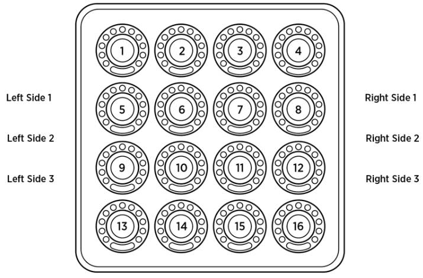
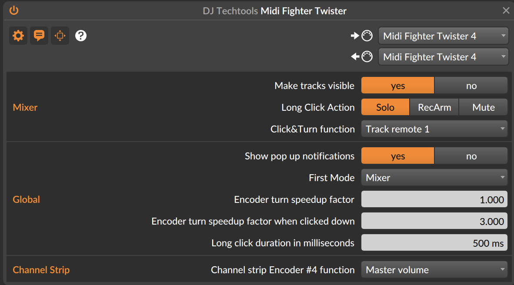
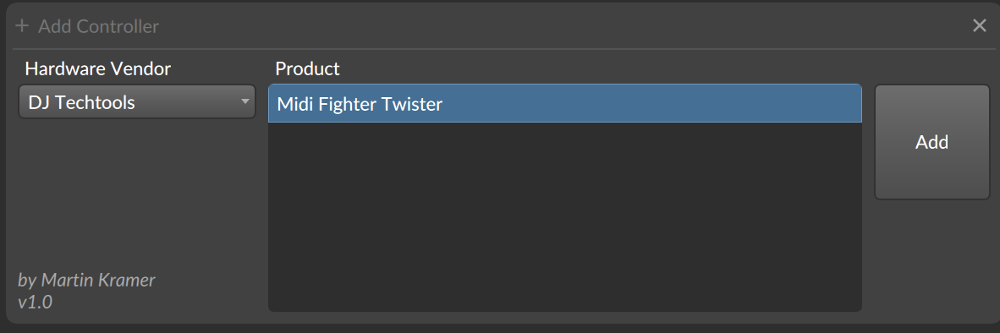
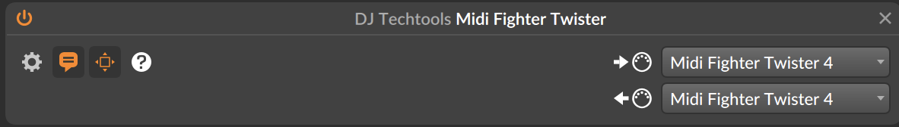

# Bitwig Performance Twister <!-- omit in toc -->

This is an extension for the Bitwig DAW (Digital Audio Workstation). 
With this extension you will be able to use the midi controller 
"Midi Fighter Twister" by DJ TechTools (see https://www.midifighter.com/#Twister). 

## Table of Contents <!-- omit in toc -->
1. [Introduction](#introduction)
    1. [Use cases](#use-cases)
1. [Overview of available features](#overview-of-the-available-features)
2. [What is not included](#what-is-not-included)
1. [Implemented Modes](#implemented-modes)
    1. [Mode 1 Mixer](#mode-1-mixer)
    1. [Mode 2 Channel Strip](#mode-2-channel-strip) 
    1. [Mode 3 Device and Project-wide Remote Controls](#mode-3-device-and-project-wide-remote-controls) 
    1. [Mode 4 EQ](#mode-4-eq)  
    1. [Mode 5 Global Parameters](#mode-5-global-parameters) 
    1. [Mode 6 User defined Controls](#mode-6-user-defined-controls) 
       
1. [Configuration](#configuration)
1. [Installation](#installation)
1. [Implementation Notes](#implementation-notes)
2. [Known Bugs](#known-bugs)
3. [Acknowledgements](#acknowledgements)
4. [License](#license)

## Introduction
Welcome to the _Bitwig Performance Twister_. I have built this controller script to be able to use the **Midi Fighter Twister** from DJ Tech Tools for my own performance needs. Although there are already controller extensions available for Bitwig, the did not fit my workflow or performance needs. When making design decision I kept the following principle in mind: 
* focus on the functionality needed most often (pareto principle)
* Don't try to make it complete
* have control elements always in the same place to allow for better _muscle memory_, e.g. don't scroll through modes, but have a dedicated button for each mode 

### Use cases
I see mostly the following use cases
* quickly switch between instruments and adjust volumes of the instruments (which are sitting in different tracks) in a live situation; do that for more than four or eight instruments (tracks)
* have a channel strip with access to the most commonly used elements for a track, use Bitwig's new track remote controls
* use the encoders to tweak device parameters
* make use of Bitwig's new project remote controls
* quickly add an EQ to a track and control four bands
* allow to use the Midi Fighter Twister also for Midi learn  

## Overview of the available features 
Bitwig performance Twister offers the following features: 

* **Modes:** The Bitwig Performance Twister offers six different modes for the 16 encoders of the midi controller. Each mode can be accessed by clicking on one of the buttons on the side. The encoders for the Midi Figher Twister then behave differently on each mode. You also have the possibility of a temporary mode switch. For that press on the side button for the mode you temporaririly want to switch to and hold the side button pressed. You can turn or click on the encoders of the newly selected mode. Once you release the side button, you immediately return to the previous mode. You can use this, for instance to quickly adjust the volume of a track in the mixer and directly return a device control. _Bitwig Performance Twister_ has the following modes: 
    * **Mixer Mode**: A mixer for 16 tracks. You can select tracks, change volume, a secondary parameter and mute, solo or arm.
    * **Channel Strip Mode**: In this mode you have access to many different parameter of a single track. You can also easily change the currently selected track
    * **Device Mode**: This gives you access to the devices and global remote controls.
    * **EQ**: Quickly createa an EQ+ devices and access four of its bands
    * **Global Parameters**: Access some global Bitwig functions and have access to transport controls
    * **User Mode**: Use the Midi Fighter Twister in its basic form, without and automatically mapped encoders  
* **Long clicks:** By clicking and keeping the encoder pressed down for a short time, you can get access to a secondary action for some of the encoders
* **Click & turn:** Click down an encoder button and turn the encoder while it's pressed down. This gives access to a secondary paramter which can be controlled with this same encoder.  

## What is not included
Although _Bitwig Performance Twister_ offers a lot of features the following are currently **not** included (among others): 
* arpeggiator
* zooming
* browsing for new devices
* adding tracks, devices, or clips
* quantization
* editing notes
* deletion of elements like tracks, devices, clips or notes

## Implemented Modes
The following sections explain the mapping of encoders and the side buttons. For that, the following chart shows us where to find the encoders and side buttons. It comes from the Midi Fighter Twister manual: 

### Mode 1 Mixer
This bank or mode contains a basic mixer for 16 channels in Bitwig. Every encoder of the Midi Fighter Twister is associated to one track in Bitwig. 

| Encoder | Turn (Twisting)      | Click & turn | Click           | Long Click          | RGB Light                   |
|:-------:|----------------------|--------------|-----------------|---------------------|-----------------------------|
|1-16     |Volume of track 1-16  |panning       |Select track 1-16|arm, mute, or solo** |color of the track in Bitwig

### Mode 2 Channel Strip
This bank focuses on a single selected track. The first encoder is used to select a track. The other encoders are
can be used to change parameters for this selected track. 

Obviously you can use other controllers or Bitwig itself to change the selected track. The encoder in this bank 
always control the parameters of the selected track. This is not always the desired state, i.e. you might want to 
keep the controls fixed on a certain track. This is what the *pin functionality* is for. Bitwig has a feature to 
pin a controller to a certain track (or device, see below). This can be done with a long click on Encoder 1. Once the 
Midi Fighter Twister is pinned to the currently selected track, the first encoder turn green and you cannot change the selected
track with encoder 1 any more. 

| Encoder | Turn (Twisting)              | Click & turn | Click             | Long Click          | RGB Light                   |
|:-------:|------------------------------|--------------|-------------------|---------------------|-----------------------------|
|1        |select a track                |tbd           |toggle arm         |pin the track        | green if track is selected  |
|2        |volume of selected track      |tbd           |toggle solo        |n/a                  | yellow if track is soloed   |
|3        |panning selected track        |tbd           |toggle mute        |n/a                  | orange if track is muted    |
|4        |volume: master,cue, x-fader(1)|tbd           |toggle fill (2)    |n/a                  | tbd                         |
|5-8      |send to fx channel 1-4        |tbd           |toggle send enabled|n/a                  | blue, dark blue if send disabled|
|9-16     |track remote control 1-8      |tbd           |toggle send enabled|n/a                  | color on Bitwig parameter page|

(1) Encoder #4 on this bank can be configured to control the
* master volume 
* cue volume
* crossfader volume  

The control depends on the setting of the controller configuration. See [Controller Configuration](#controller-configuration).

(2) A click on encoder #4 on this bank toggle the global Bitwig fill flag which effects operators

### Mode 3 Device and Project-wide Remote Controls
| Encoder | Turn (Twisting)        | Click & turn | Click                    | Long Click          | RGB Light                      |
|:-------:|------------------------|--------------|--------------------------|---------------------|--------------------------------|
|1        |device parameter 1      |tbd           |go to first device        |toggle device on/off | color on Bitwig parameter page |
|2        |device parameter 2      |tbd           |go to previous deviece    |n/a                  | color on Bitwig parameter page |
|3        |device parameter 3      |tbd           |go to next device         |n/a                  | color on Bitwig parameter page |
|4        |device parameter 4      |tbd           |go to last device         |n/a                  | color on Bitwig parameter page |
|5        |device parameter 5      |tbd           |go to first param bank    |n/a                  | color on Bitwig parameter page |
|6        |device parameter 6      |tbd           |go to previous param bank |n/a                  | color on Bitwig parameter page |
|7        |device parameter 7      |tbd           |go to next param bank     |n/a                  | color on Bitwig parameter page |
|8        |device parameter 8      |tbd           |go to last param bank     |n/a                  | color on Bitwig parameter page |
|9        |Project remote  1       |tbd           |go to first device        |toggle device on/off | color on Bitwig parameter page |
|10       |Project remote  2       |tbd           |go to previous device     |n/a                  | color on Bitwig parameter page |
|11       |Project remote  3       |tbd           |go to next device         |n/a                  | color on Bitwig parameter page |
|12       |Project remote  4       |tbd           |go to last device         |n/a                  | color on Bitwig parameter page |
|13       |Project remote  5       |tbd           |go to first param bank    |n/a                  | color on Bitwig parameter page |
|14       |Project remote  6       |tbd           |go to previous param bank |n/a                  | color on Bitwig parameter page |
|15       |Project remote  7       |tbd           |go to next param bank     |n/a                  | color on Bitwig parameter page |
|16       |Project remote  8       |tbd           |go to last param bank     |n/a                  | color on Bitwig parameter page |

### Mode 4 EQ
This mode is there to help you twist and turn the prarameters of the Bitwig EQ+. In case there is an EQ+ installed in the device chain of the currently selected track, the encoders of the Midi Fighter Twister are automatically mapped to this EQ device. In case there is no EQ available you can easily create a new EQ+ device by simply clicking on any encoder button. This installs the  new EQ+ at the end of the device chain. 

| Encoder | Turn (Twisting)     | Click & turn | Click                     | Long Click           | RGB Light                 |
|:-------:|---------------------|--------------|---------------------------|----------------------|---------------------------|
|1        |gain for band 1      |n/a           |toggle band on/off         |toggle device on/off (1) | Bitwig EQ color of band 1 (2) |
|2        |gain for band 2      |n/a           |toggle band on/off         |toggle window         | Bitwig EQ color of band 2 |
|3        |gain for band 3      |n/a           |toggle band on/off         |n/a                   | Bitwig EQ color of band 3 |
|4        |gain for band 4      |n/a           |toggle band on/off         |n/a                   | Bitwig EQ color of band 4 |
|5        |frequency of bank 1  |n/a           |reset frequency to default |n/a                   | Bitwig EQ color of band 1 |
|6        |frequency of bank 2  |n/a           |reset frequency to default |n/a                   | Bitwig EQ color of band 2 |
|7        |frequency of bank 3  |n/a           |reset frequency to default |n/a                   | Bitwig EQ color of band 3 |
|8        |frequency of bank 4  |n/a           |reset frequency to default |n/a                   | Bitwig EQ color of band 4 |
|9        |Q valaue for band 1  |n/a           |reset Q to default         |n/a                   | Bitwig EQ color of band 1 |
|10       |Q valaue for band 2  |n/a           |reset Q to default         |n/a                   | Bitwig EQ color of band 2 |
|11       |Q valaue for band 3  |n/a           |reset Q to default         |n/a                   | Bitwig EQ color of band 3 |
|12       |Q valaue for band 4  |n/a           |reset Q to default         |n/a                   | Bitwig EQ color of band 4 |
|13       |EQ type for band 1   |n/a           |toggle band on/off (3)     |n/a                   | Bitwig EQ color of band 1 |
|14       |EQ type for band 2   |n/a           |toggle band on/off (3)     |n/a                   | Bitwig EQ color of band 2 |
|15       |EQ type for band 3   |n/a           |toggle band on/off (3)     |n/a                   | Bitwig EQ color of band 3 |
|16       |EQ type for band 4   |n/a           |toggle band on/off (3)     |n/a                   | Bitwig EQ color of band 4 |

* (1) A long click on the first encoder toggles the EQ+ device on an off. 
* (2) The color of the encoders in a column reflect (somehow closely) the color of the band in the EQ+ decive in bitwig. All encoders for a band (i.e. in a colum) have the same color. The colored led is switched off when the respective band is deactivated. You can still turn the parameters and see their value on the out ring though.
* (3) A click on the encoder of the last row toggles the band on or off. This toggle switch is different to the toggle switch of the first row as it resets the band to the following useful band types: band 0: 24db low cut, band 1-2: bell curve, band 3: high shelf

### Mode 5 Global Parameters
This mode allows you to control many actions of the Bitwig transport section and global parameter like master volume, cue volume, cross fader setting, etc. You can also use it to quickly change the appearance of the Bitwig window, e.g. by toggling the inspector on the left side. Note: all encoders have function assign to clicking it, but not all encoders react to turning. 

| Encoder | Turn (Twisting)     | Click & turn | Click                          | Long Click           | RGB Light                    |
|:-------:|---------------------|--------------|--------------------------------|----------------------|------------------------------|
|1        |start cursor (coarse)|              |start/pause                     |                      | green if play, off otherwise |
|2        |start cursorn (fine) |              |stop                            |toggle window         | off                          |
|3        |cross fader          |              |toggle record                   |                      | red if record enable         |
|4        |master volumen       |              |toggle arranger loop            |                      | blue if arranger loop enabled|
|5        |                     |              |toggle fill (used by operators) |                      | off                          |
|6        |                     |              |toggle midi overdub             |                      | off                          |
|7        |cue volume           |              |toggle metronom                 |                      | off                          |
|8        |tempo (normal)       |tempo (fine)  |tap tempo                       |                      | off                          |
|9        |selected track       |              |previous project                |                      | off                          |
|10       |                     |              |next project                    |                      | off                          |
|11       |                     |              |activate audio                  |                      | off                          |
|12       |                     |              |n/a                             |                      | off                          |
|13       |                     |              |toggle inspector                |toggle device view    | off                          |
|14       |                     |              |change to arranger view         |toggle mixer view     | off                          |
|15       |                     |              |change to mix view              |toggle note editor    | off                          |
|16       |                     |              |change to edit view             |toggle full screen    | off                          |

### Mode 6 User defined controls
This mode simply allows to bypass the controller script and allows you to use it for your own Midi Learn mapping. When accessing the mode 6 the Midi Figther Twister is set internally to bank four. You can also configure the CC message and colors in the `Midifighter Utility`. Please keep the midi channels to five and six, respectively.  

## Configuration
The _Bitwig Performance Twister_ can be configured to suit to your needs. In order to change the configuration click on the Bitwig Icon on the top of the Bitwig screen, then change to _configuration_ and there choose _controller_ on the left side. 

The following configuration items are avaialable: 
* **_Global_**
    * **Encoder turn speedup factor**: This is a factor that influence how fast the encoder change values in Bitwig. A factor >1 speeds up the value change, a factor <1 slows down the speed of change.
  
    *   **Encoder turn speedup factor when clicked down** This is a speedup factor which is applied when the encoder is clicked down and turned at the same time. This factor can be used to increase the speed of change, e.g. when using a secondary parameter in the mixer mode.
   *    **Show pop up notification**: Should the script show pop of notification of what is happening or not (e.g. when changing modes)
   *    **Long click duration in milliseconds** The time it takes for a long click to be noticed. The parameter is in milliseconds. Adapt this to you personal liking.
   *    **First mode**: Here you specify which will be the first mode once the Midi Fighter Twister is initialized. You can choose from all six available modes.    
* **_Mixer mode_**
    * **Make tracks visible**: When you select a track or change the volume of a track, should Bitwig also bring this track into the foreground (or not). This parameter only has an effect if you have many tracks and some are hidden.
    * **Long click action** In the mixer you can use a long click to fire up an action on the track associated to the encoder. You can toggle *solo* for the track, toggle *record arm*, or toggle *mute*.
    *    **Click&Turn function**: In the mixer you have the possibility to control a secondary parameter with each encoder (remember, the first function is to change the volume). Here you can decide which function you want to control. You can either change the _panning_ or change the _send_ level to the first FX track or change the level of the first _remote control_ of the track. This is a great tool during performances.
* **_Channel Strip Mode_**
    * **Channel Strip Encoder #4 function**: This lets you control the Bitwig parameter which is changed when you turn the fourth encoder on the first row in the channel strip mode. You can choose _master volume_, crossfader_, or _cue volume_.           

## Installation
The installation of _Bitwig Performance Twister_ is straight forward. It requires basically four steps: 1. download and unpack the zip file of the latest release, 2. update the Midi Fighter Twister with the configuration provided in the zip file , 3. place the Bitwig extension into the correct Bitwig folder and 4. configure the controller . Here's the installation step by step: 
1. Download the zip file from here and upack to whereever you like it
2. Open `Midifighter Utility` application that comes with the Midi Fighter Twister (optionally and a good idea, you might need/want to update to the latest firmware by using `Tools -> Load Factory Firmware -> Midi Fighter Twister 4 (02 Oct 2019)`
3. Load the configuration into the `Midifigther Utility` with `File -> Import Settings...`. Then upload the configuration into the midi controller with a click on `SEND TO MIDIGFIGHTER`.
4. Copy `BitwigPerformanceTwister.bwextension` to the following location:

    - Windows: `%USERPROFILE%/Documents/Bitwig Studio/Extensions`
    - Mac:     `~/Documents/Bitwig Studio/Extensions`
    - Linux:   `~/Bitwig Studio/Extensions` 

5. Open Bitwig, go to the dashboard, click on `Configuration -> Controller`. Click on `+ Add controller`
6. Select `DJ Techtools` on the left side and select `Midi Fighter Twister` on the right, see screenshot below

7. Select the input and output midi connection by choosing `Midi Fighter Twister`from the dropdown box, see screenshot below

## Implementation Notes 
* **Modes and Banks:** Although the Midi Performance Twister (this script) has six modes, the Midi Fighter Twister (the hardware device) has only four banks. The modes which are associated to the left side buttons (mixer mode, EQ mode, global mode) are mapped to the first bank of the hardware device. The channel strip mode is mapped to bank two. The device mode is mapped to bank three. The user assignable mode on bank four. This is also the bank that you can freely assign to your liking. Changing any parameter on banks one to three of the hardware device will cause this script to malfunction.
* Unfortunately, the color palette of the LED lights below the encoders of the Midi Fighter is limited. _Bitwig Performance Twister_ uses the approximation of [Twister Sister](...) by Dan Smith.
* Unfortunately I could not test this script on Windows or Linux. Please help to test it and make it available to these communities, as well. 

## Known Bugs
* The secondary click&turn function for send to fx1 and track remote #1 is not yet implemented. This will shortly follow.
* In the `MidiFighter Utility`tool, the check boxes, e.g. for the side buttons, don't seem to work corretly. The check box `Bank Side Buttons`under `Global Settings` needs to be de-activated and then the MFT needs to be flushed with this value. After flushing the check mark disappears, even if it had been checked before. It's important that is not activated. In this case the side buttons always send the same CC messages. And this is what we want.

## Acknowledgements
I am very thankful to Jürgen Moßgräber (MOSS) for his support of the midi controller API. I am using several of his scripts for other controllers and the youtube videos on how to use the Bitwig controller API have been a tremendous help. I could not have implemented this without his contributions. 

## License
* (c) 2023 copyright Dr. Martin Kramer
* This Bitwig extension is alvailable under the GNU LESSER GENERAL PUBLIC LICENSE, Version 3, see the license text [here](../LICENSE). 

## Dependencies
_Bitwig Performance Twister_ uses the following libraries 
* [Twister Sister](https://github.com/dozius/TwisterSister/tree/main), Copyright 2021 Dan Smith

