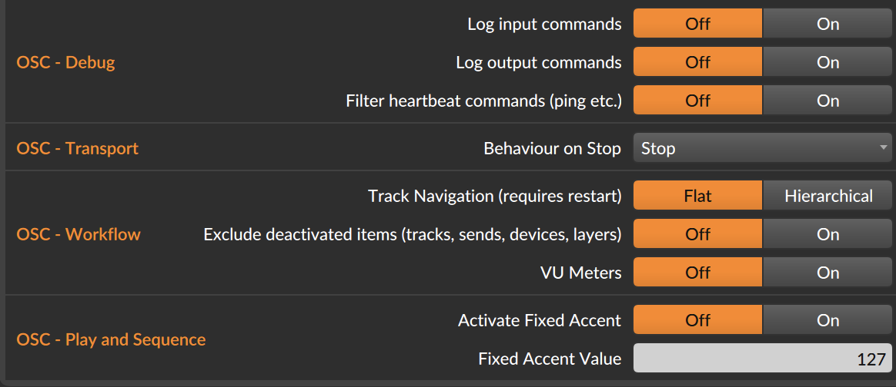

# Bitwig Performance Twister <!-- omit in toc -->

This is an extension for the Bitwig DAW (Digital Audio Workstation). 
With this extension you will be able to use the midi controller 
"Midi Fighter Twister" by DJ TechTools (see https://www.midifighter.com/#Twister). 

## Table of Contents <!-- omit in toc -->
1. [Introduction](#introduction)
    1. [Use cases](#use-cases)
1. [Overview of available features](#overview-of-the-available-features)
2. [What is not included](#what-is-not-included)
3. [Changing Modes](#changing-modes)
1. [Implemented Modes](#implemented-modes)
    1. [Mode 1 Mixer](#mode-1-mixer)
    1. [Mode 2 Channel Strip](#mode-2-channel-strip) 
    1. [Mode 3 EQ](#mode-3-eq)  
    1. [Mode 4 Device and Project-wide Remote Controls](#mode-4-device-and-project-wide-remote-controls) 
    1. [Mode 5 Global Parameters](#mode-5-global-parameters) 
    1. [Mode 6 User defined Controls](#mode-6-user-defined-controls) 
       
1. [OSC Extension](#OSC-Extension)
2. [Configuration](#configuration)
1. [Installation](#installation)
1. [Implementation Notes](#implementation-notes)
2. [Known Bugs](#known-bugs)
3. [Acknowledgements](#acknowledgements)
4. [License](#license)

## Introduction
Welcome to the _Bitwig Performance Twister_. I have built this controller script to be able to use the **Midi Fighter Twister** (MFT )from DJ Tech Tools for my own performance needs. Although there are already controller extensions available for Bitwig, the did not fit my workflow or performance needs. When making design decision I kept the following principle in mind: 
* focus on the functionality needed most often (pareto principle)
* Don't try to make it complete
* have control elements always in the same place to allow for better _muscle memory_, e.g. don't scroll through modes, but have a dedicated button for each mode

This script also has a built-in extension allow visiual feedback on what's happening on the Midi Fighter Twister by using devices like a table in conjunction with the MFT. For instance, I am using TouchOSC on an Ipad that I placed behind the MFT. That way I can directly see the function of each encoder. 

### Use cases
I see mostly the following use cases
* quickly switch between instruments and adjust volumes of the instruments (which are sitting in different tracks) in a live situation; do that for more than four or eight instruments (tracks)
* have a channel strip with access to the most commonly used elements for a track, use Bitwig's new track remote controls
* use the encoders to tweak device parameters
* make use of Bitwig's new project remote controls
* quickly add an EQ to a track and control four bands
* allow to use the Midi Fighter Twister also for Midi learn
* Use the OSC extension to build up your own touch screen (ala Hans Zimmer)  

The following picture shows how I use the Midi Fighter Twister with Bitwig. 

## Overview of the available features 
Bitwig performance Twister offers the following features: 

* **Modes:** The Bitwig Performance Twister offers six different modes for the 16 encoders of the midi controller. Each mode can be accessed by clicking on one of the buttons on the side. The encoders for the Midi Figher Twister then behave differently on each mode. You also have the possibility of a temporary mode switch. For that press on the side button for the mode you temporaririly want to switch to and hold the side button pressed. You can turn or click on the encoders of the newly selected mode. Once you release the side button, you immediately return to the previous mode. You can use this, for instance to quickly adjust the volume of a track in the mixer and directly return a device control. _Bitwig Performance Twister_ has the following modes: 
    * **Mixer Mode**: A mixer for 16 tracks. You can select tracks, change volume, a secondary parameter and mute, solo or arm.
    * **Channel Strip Mode**: In this mode you have access to many different parameter of a single track. You can also easily change the currently selected track
    * **Device Mode**: This gives you access to the devices and global remote controls.
    * **EQ**: Quickly createa an EQ+ devices and access four of its bands
    * **Global Parameters**: Access some global Bitwig functions and have access to transport controls
    * **User Mode**: Use the Midi Fighter Twister in its basic form, without and automatically mapped encoders  
* **Long clicks:** By clicking and keeping the encoder pressed down for a short time, you can get access to a secondary action for some of the encoders
* **Click & turn:** Click down an encoder button and turn the encoder while it's pressed down. This gives access to a secondary paramter which can be controlled with this same encoder.

This script also comes with the OSC implementation provided by Jürgen Moßgräber inclucded. Additionaly there are OSC commands specifically for the MFT and a template for TouchOSC. Note, you can run the script without any OSC features, but with it, the functionality of the Midi Fighter Twister is greatly enhanced when using Bitwig. 

## What is not included
Although _Bitwig Performance Twister_ offers a lot of features the following are currently **not** included (among others): 
* arpeggiator
* browsing for new devices
* adding tracks, devices (with the exception of EQ+), or clips 
* quantization
* editing notes
* deletion of elements like tracks, devices, clips or notes

## Changing Modes
The following sections explain the mapping of encoders and the side buttons. For that, the following chart shows us where to find the encoders and side buttons. It comes from the Midi Fighter Twister manual: 

You can access the different modes of the Bitwig Performance Twister in two ways: 
1. use the buttons on the side of the MFT and
2. 2. use a combination of a shift encoder button and another encoder to change the mode to. For that encoder 13, the one on the left last row serves as the shift encoder for changing modes.  

| Mode	 		| Side Button Access	     	 | Shift Click Access 						|
|:----------------------|--------------------------------|--------------------------------------------------------------|
|Mixer Mode		|Press left side encoder 1 	 |press and hoder encoder 13 (left shift) and click encoder 1   |
|Channel Strip Mode	|Press right side encoder 1 	 |press and hoder encoder 13 (left shift) and click encoder 2   |
|EQ Mode		|Press left side encoder 2 	 |press and hoder encoder 13 (left shift) and click encoder 5   |
|Device Mode		|Press right side encoder 2 	 |press and hoder encoder 13 (left shift) and click encoder 6   |
|Global Parameter Mode	|Press left side encoder 3 	 |press and hoder encoder 13 (left shift) and click encoder 9   |
|User Mode 		|Press right side encoder 3 	 |press and hoder encoder 13 (left shift) and click encoder 10   |

## Implemented Modes
### Mode 1 Mixer
This bank or mode contains a basic mixer for 16 channels in Bitwig. Every encoder of the Midi Fighter Twister is associated to one track in Bitwig. 

| Encoder | Turn (Twisting)      | Click & turn | Click           | Long Click            |Shift Click (1)      | RGB Light                   |
|:-------:|----------------------|--------------|-----------------|-----------------------|---------------------|-----------------------------|
|1-14     |Volume of track 1-14  |panning (2)   |Select track 1-16|arm, mute, or solo (3) |Scene or marker 1-14 |color of the track in Bitwig |
|15       |Volume of track 15    |panning (2)   |Select track 15  |arm, mute, or solo (3) |stop                 |color of the track in Bitwig |
|16       |Volume of track 16    |panning (2)   |Select track 16  |arm, mute, or solo (3) |shift button         |color of the track in Bitwig |

#### Notes
* (1) Encoder 16 (lower row right) can be used a shift key. I.e. click and hold down this encoder and click on any other encoder. This triggers a scene (from scene 1 to 14) or the launch of a cue marker (marker 1-14). You can customize the behaviour in the [controller configuration](#configuration), below.   
* (2) You can access a second functionality on each encoder when holding down the encoder ("Click&turn"). This is great for live performance, i.e. in this mode you can change the volume and then with the same encoder add an effect. This can be either panning, the send to FX channel 1 or changing the first track remote control. The behavior can be customized in the controller configuration. 
* (3) A long click on an encoder adds another action. Again, you can customize the action in the controller configuration. You can choose from the following three actions: 1. record arm the track, mute, or solo the track. 

### Mode 2 Channel Strip
This bank focuses on a single selected track. The first encoder is used to select a track. The other encoders are
can be used to change parameters for this selected track. 

Obviously you can use other controllers or Bitwig itself to change the selected track. The encoder in this bank 
always control the parameters of the selected track. This is not always the desired state, i.e. you might want to 
keep the controls fixed on a certain track. This is what the *pin functionality* is for. Bitwig has a feature to 
pin a controller to a certain track (or device, see below). This can be done with a long click on Encoder 1. Once the 
Midi Fighter Twister is pinned to the currently selected track, the first encoder turn green and you cannot change the selected
track with encoder 1 any more. 

| Encoder | Turn (Twisting)              | Click & turn | Click             | Long Click   | Shift Click (2) | RGB Light                   |
|:-------:|------------------------------|--------------|-------------------|--------------|-----------------|--------------|
|1        |select a track                |              |toggle arm         |pin the track | scene or marker | green if track is selected  |
|2        |volume of selected track      |              |toggle solo        |n/a           | scene or marker | yellow if track is soloed   |
|3        |panning selected track        |              |toggle mute        |n/a           | scene or marker | orange if track is muted    |
|4        |volume: master,cue, x-fader(1)|              |toggle fill (2)    |n/a           | scene or marker | tbd                         |
|5-8      |send to fx channel 1-4        |              |toggle send enabled|n/a           | scene or marker | blue, dark blue if send disabled|
|9-14     |track remote control 1-6      |              |                   |n/a           | scene or marker | color on Bitwig parameter page|
|15       |track remote control 7        |              |                   |n/a           | stop            | color on Bitwig parameter page|
|16       |track remote control 8        |              |                   |n/a           | Shift button    | color on Bitwig parameter page|

#### Notes
* (1) Encoder #4 on this bank can be configured to control the...
	* master volume 
	* cue volume
	* crossfader volume  
* (2) see mixer mode for shift click

The control depends on the setting of the controller configuration. See [Controller Configuration](#controller-configuration).

(2) A click on encoder #4 on this bank toggle the global Bitwig fill flag which effects operators

### Mode 3 EQ
This mode is there to help you twist and turn the prarameters of the Bitwig EQ+. In case there is an EQ+ installed in the device chain of the currently selected track, the encoders of the Midi Fighter Twister are automatically mapped to this EQ device. In case there is no EQ available you can easily create a new EQ+ device by simply clicking on any encoder button. This installs the  new EQ+ at the end of the device chain. 

| Encoder | Turn (Twisting)     | Click & turn | Click                     | Long Click           | RGB Light                 |
|:-------:|---------------------|--------------|---------------------------|----------------------|---------------------------|
|1        |gain for band 1      |n/a           |toggle band on/off         |toggle device on/off (1) | Bitwig EQ color of band 1 (2) |
|2        |gain for band 2      |n/a           |toggle band on/off         |toggle window         | Bitwig EQ color of band 2 |
|3        |gain for band 3      |n/a           |toggle band on/off         |n/a                   | Bitwig EQ color of band 3 |
|4        |gain for band 4      |n/a           |toggle band on/off         |n/a                   | Bitwig EQ color of band 4 |
|5        |frequency of bank 1  |change fast   |reset frequency to default |n/a                   | Bitwig EQ color of band 1 |
|6        |frequency of bank 2  |change fast   |reset frequency to default |n/a                   | Bitwig EQ color of band 2 |
|7        |frequency of bank 3  |change fast   |reset frequency to default |n/a                   | Bitwig EQ color of band 3 |
|8        |frequency of bank 4  |change fast   |reset frequency to default |n/a                   | Bitwig EQ color of band 4 |
|9        |Q valaue for band 1  |n/a           |reset Q to default         |n/a                   | Bitwig EQ color of band 1 |
|10       |Q valaue for band 2  |n/a           |reset Q to default         |n/a                   | Bitwig EQ color of band 2 |
|11       |Q valaue for band 3  |n/a           |reset Q to default         |n/a                   | Bitwig EQ color of band 3 |
|12       |Q valaue for band 4  |n/a           |reset Q to default         |n/a                   | Bitwig EQ color of band 4 |
|13       |EQ type for band 1   |n/a           |toggle band on/off (3)     |n/a                   | Bitwig EQ color of band 1 |
|14       |EQ type for band 2   |n/a           |toggle band on/off (3)     |n/a                   | Bitwig EQ color of band 2 |
|15       |EQ type for band 3   |n/a           |toggle band on/off (3)     |n/a                   | Bitwig EQ color of band 3 |
|16       |EQ type for band 4   |n/a           |toggle band on/off (3)     |n/a                   | Bitwig EQ color of band 4 |

* (1) A long click on the first encoder toggles the EQ+ device on an off. 
* (2) The color of the encoders in a column reflect (somehow closely) the color of the band in the EQ+ decive in bitwig. All encoders for a band (i.e. in a colum) have the same color. The colored led is switched off when the respective band is deactivated. You can still turn the parameters and see their value on the out ring though.
* (3) A click on the encoder of the last row toggles the band on or off. This toggle switch is different to the toggle switch of the first row as it resets the band to the following useful band types: band 1: 24db low cut, band 2-3: bell curve, band 4: high shelf

### Mode 4 Device and Project-wide Remote Controls
| Encoder | Turn (Twisting)        | Click & turn | Click                    | Long Click          | RGB Light                      |
|:-------:|------------------------|--------------|--------------------------|---------------------|--------------------------------|
|1        |device parameter 1      |              |go to first device        |toggle device on/off | color on Bitwig parameter page |
|2        |device parameter 2      |              |go to previous deviece    |n/a                  | color on Bitwig parameter page |
|3        |device parameter 3      |              |go to next device         |n/a                  | color on Bitwig parameter page |
|4        |device parameter 4      |              |go to last device         |n/a                  | color on Bitwig parameter page |
|5        |device parameter 5      |              |go to first param bank    |n/a                  | color on Bitwig parameter page |
|6        |device parameter 6      |              |go to previous param bank |n/a                  | color on Bitwig parameter page |
|7        |device parameter 7      |              |go to next param bank     |n/a                  | color on Bitwig parameter page |
|8        |device parameter 8      |              |go to last param bank     |n/a                  | color on Bitwig parameter page |
|9        |Project remote  1       |              |                          |n/a                  | color on Bitwig parameter page |
|10       |Project remote  2       |              |                          |n/a                  | color on Bitwig parameter page |
|11       |Project remote  3       |              |                          |n/a                  | color on Bitwig parameter page |
|12       |Project remote  4       |              |                          |n/a                  | color on Bitwig parameter page |
|13       |Project remote  5       |              |go to first prj.param bank    |n/a                  | color on Bitwig parameter page |
|14       |Project remote  6       |              |go to previous prj.param bank |n/a                  | color on Bitwig parameter page |
|15       |Project remote  7       |              |go to next prj.param bank     |n/a                  | color on Bitwig parameter page |
|16       |Project remote  8       |              |go to last prj. param bank    |n/a                  | color on Bitwig parameter page |

### Mode 5 Global Parameters
This mode allows you to control many actions of the Bitwig transport section and global parameter like master volume, cue volume, cross fader setting, etc. You can also use it to quickly change the appearance of the Bitwig window, e.g. by toggling the inspector on the left side. Note: all encoders have function assign to clicking it, but not all encoders react to turning. 

| Encoder | Turn (Twisting)      | Click & turn      | Click                          | Long Click           | RGB Light                       |
|:-------:|----------------------|-------------------|--------------------------------|-----------------------|---------------------------------|
|1        |start cursor (coarse) |                   |start/pause                     |                       | green if play, off otherwise (1)|
|2        |start cursorn (fine)  |                   |stop                            |toggle window          | off                             |
|3        |cross fader           |                   |toggle record                   |                       | red if record enable            |
|4        |arranger loop duration|arranger loop start|toggle arranger loop            |                       | blue if arranger loop enabled   |
|5        |                      |                   |toggle fill (used by operators) |                       | off                             |
|6        |                      |                   |toggle clip     overdub         |toggle arranger overdub| off                             |
|7        |cue volume            |                   |toggle metronom                 |                       | off                             |
|8        |tempo (normal)        |tempo (fine)       |tap tempo                       |                       | off                             |
|9        |selected track        |                   |previous project                |                       | off                             |
|10       |master volume         |                   |next project                    |                       | off                             |
|11       |Bank, LSB (3)         |Bank, MSB          |activate audio                  |                       | off                             |
|12       |program change (3)    |prgrm chnge (fast) |n/a                             |                       | off                             |
|13       |zoom in and out       |                   |toggle inspector                |toggle device view     | off                             |
|14       |                      |                   |change to arranger view         |toggle mixer view      | off                             |
|15       |                      |                   |change to mix view              |toggle note editor     | off                             |
|16       |next/previous patch(2)|                   |change to edit view             |toggle full screen     | off                             |

#### Notes
* (1) When Bitwig is playing the first encoder turns green and flashes in the rhythm of quarter notes. In order to allow for this feature to work correctly you need to send midi clock to the Midi Fighter Twister. You can do that by adding a track and installing a Bitwig _HW INSTRUMENT_ in the device chain. On the HW INSTRUMENT you need to select the Midi Fighter Twister as Midi Out and enable Midi Clock, see screenshot below. 
* (2) When turning encoder 16 you can generate two different CC messages which can be used to to map to a _next patch_ and _previous patch_ button on your (VST) device. As an example, I have matched this to the Omnisphere next/previous patch buttons. With that I can easily scoll through patches using one encoder of the Midi Fighter Twister.   
* (3) Program change message can be triggered when turning encoder 12. They are sent on channel 1 for the currently selected track. On encoder 11 bank messages can be sent. Both LSB and MSB are available (you need to press down for changing the MSB). In the configuration you can set if the bank message should be sent before a program change message. 

### Mode 6 User defined controls
This mode simply allows to bypass the controller script and allows you to use it for your own Midi Learn mapping. When accessing the mode 6 the Midi Figther Twister is set internally to bank four. You can also configure the CC message and colors in the `Midifighter Utility`. Please keep the midi channels to five and six, respectively.  

## OSC Extension
This script extends the functionality of the Midi Fighter Twister with additional visual feedback. This is based on OSC, the Open Sound Protocol. This protocol allow to connect an additional device (like a tablet or another computer or phone) with this script and control Bitwig or just visualize what you are controlling the the Midid Fighter Twister. By doing this you greatly enhance your workflow, i.e. by using the Midi Fighter Twister with its great encoders and also being able to see what you can control (as the MFT does not have any screens). With this functionality you can either
* build your own custom controller surface and show the status of the Midi Fighter Twister, or
* use the template for TouchOSC which comes with this script, see section on configuration below. (Note: you need to buy a an additional license for TouchOSC. This is not included in Bitwig Performance Twister )

The following section describe how to use the visualization in TouchOSC. The great thing about OSC is that you can fully customize the visualization to your own needs. Or simply start of with the one that comes with this script. 

### The Mixer page
When changing into the mixer mode the following screenshot shows the status of the encoders and additional information. 

On the left side, under _Current Mode_ you can see which mode is currently active. The screen on the right shows the 16 encoders of the Midi Fighter Twister. In case not all encoders are active, like in this case, the encoders are hidden. The following information is available : 
* In the middle of the encoder, the name of the track is shown.
* The currently selected track is indicated by star below the track name. In this case it's the track _Top Loop_.
* On the right side of the encoder you can find further information about the functionality of each encoder. From top to bottom
  	* What happens when you turn the encoder. In the mixer mode, it's the track volume.
  	* The function when you press down an encoder and turn the encoder. This is configurable, in this setup it's the send to Effects Channel 1.
  	* The function when you click an encoder. Here, it's to select the associated track.
  	* What happens when you long click an encoder. In this setup it's to activate Solo
  	* Lastly, what happens when you shift click an encoder. This is also configurable, in this example a shift click triggers a scene.

### The Channel Strip Page
The following screenshot shows the visualization of the Channel Strip mode.   

This page can be structured in three parts: 
1. The first line of encoders is always fixed. 
2. The second line shows four encoders that represent the send levels to up to four effects channels
3. The last two lines of encoders are active when a track remote page is active. 
  

### The EQ Page
The following screenshot shows the visualization of the EQ mode.   

The EQ pages visualizse the four bands which can be controlled with the Midi Figher Twister. Look how the color of the encoders change with the frequency of the band. The color reflects color of the EQ+ device in Bitwig. 

### The Device Page
The following screenshot shows the visualization of the Device mode.  

The device page can be structured into two parts: 
1. The upper two lines of 8 encoders which reflect the currently selected device, and
2. the lower two lines which reflect the project remove parameters. 
  
### The Global Parameters Page
The following screenshot shows the visualization of the Global Parameters mode.   

The visualization with OSC is especially useful for a mode like the _Global Parameter Mode_. This mode contains a lot of different control possibilities. But without a screen on the Midi Figther Twister the different functionalities are hard to remember. Thus, a tablet placed behind the MFT comes in handy to show the meaning of the 16 encoders. 
  
## Configuration
The _Bitwig Performance Twister_ can be configured to suit to your needs. In order to change the configuration click on the Bitwig Icon on the top of the Bitwig screen, then change to _configuration_ and there choose _controller_ on the left side. 

### Basic Configuration
The following configuration items are avaialable: 
* **_Global_**
    * **Encoder turn speedup factor**: This is a factor that influence how fast the encoder change values in Bitwig. A factor >1 speeds up the value change, a factor <1 slows down the speed of change.
  
    *   **Encoder turn speedup factor when clicked down** This is a speedup factor which is applied when the encoder is clicked down and turned at the same time. This factor can be used to increase the speed of change, e.g. when using a secondary parameter in the mixer mode.
   *    **Show pop up notification**: Should the script show pop of notification of what is happening or not (e.g. when changing modes)
   *    **Long click duration in milliseconds** The time it takes for a long click to be noticed. The parameter is in milliseconds. Adapt this to you personal liking.
   *    **First mode**: Here you specify which will be the first mode once the Midi Fighter Twister is initialized. You can choose from all six available modes.    
* **_Mixer mode_**
    * **Make tracks visible**: When you select a track or change the volume of a track, should Bitwig also bring this track into the foreground (or not). This parameter only has an effect if you have many tracks and some are hidden.
    * **Long click action** In the mixer you can use a long click to fire up an action on the track associated to the encoder. You can toggle *solo* for the track, toggle *record arm*, or toggle *mute*.
    *    **Click&Turn function**: In the mixer you have the possibility to control a secondary parameter with each encoder (remember, the first function is to change the volume). Here you can decide which function you want to control. You can either change the _panning_ or change the _send_ level to the first FX track or change the level of the first _remote control_ of the track. This is a great tool during performances.
* **_Channel Strip Mode_**
    * **Channel Strip Encoder #4 function**: This lets you control the Bitwig parameter which is changed when you turn the fourth encoder on the first row in the channel strip mode. You can choose _master volume_, crossfader_, or _cue volume_.           
* **_Global Parameters Mode_**
	* **Send bank messages before program change**: Encoder 12 lets you send program change messages. With encoder 11 you can specify the MSB and LSB of the bank message. In case "yes" is selected a bank message is sent before each program change message.  

### Extended Configuration for the OSC Extension 
Additional configuration is required and possible for the extension with OSC to enable visualization with tools with TouchOSC. _Bitwig Performance Twister_ utilizes the OSC implementation developed by Jürgen Moßgräber, aka MOSS. The following configuration items are directly associated to his OSC implementation. See additional information here [here](https://github.com/git-moss/DrivenByMoss). 

The following screenshot shows the first part of the configuration items. 

This most important configuration to use the OSC extension are the first three parameters. You need to get these right otherwise the the OSC extension will not work. The good think is, you don't need to deal with all the other configuration items. The initial setup might be a bit confusing. The following chart shows an example to facilitate the understanding of the setup.  

One the left side you can see your computer on which Bitwig is running. Within Bitwig the Bitwig Performance Twister is running. This enables the communication between Bitwig and the Midi Fighter Twister (shown below) which is connected via USB to your computer. On the right side you can see a tablet that is running TouchOSC. TouchOSC and Bitwig communicate via the Bitwig Performance Twister script. In order to allow for a bi-directional communication, both side, Bitwig and TouchOSC must be configured to communicate to each other. 

Let's start with the Bitwig side. Within the controller section you need to provide the address of the table that is running TouchOSC. You also need to provide the port number on which TouchOSC is listening to incoming OSC messages. Moreover you also need to provide the port number on which Bitwig is listening to incoming OSC messages from TouchOSC. 

On the other side, on the tablet you need to configure TouchOSC to communicate to Bitwig. Again you need to provide the port number on both side. 

In order to to get the communication going you need to consider two important things: 
1. You need to supply the IP address of the other side
2. The _receiving port_ and the _port to send to_ must be cross over. 

The following screenshot shows some more OSC related configuration items. Again, these are useful it you want to use additional OSC functionality. Please visit the excellent site of MOSS with a detailed description on how these configuration items work. 

## Installation
The installation of _Bitwig Performance Twister_ is straight forward. It requires basically four steps: 1. download and unpack the zip file of the latest release, 2. update the Midi Fighter Twister with the configuration provided in the zip file , 3. place the Bitwig extension into the correct Bitwig folder and 4. configure the controller . Here's the installation step by step: 
1. Download the zip file from here and upack to whereever you like it
2. Open `Midifighter Utility` application that comes with the Midi Fighter Twister (optionally and a good idea, you might need/want to update to the latest firmware by using `Tools -> Load Factory Firmware -> Midi Fighter Twister 4 (02 Oct 2019)`
3. Load the configuration into the `Midifigther Utility` with `File -> Import Settings...`. Then upload the configuration into the midi controller with a click on `SEND TO MIDIGFIGHTER`.
4. Copy `BitwigPerformanceTwister.bwextension` to the following location:

    - Windows: `%USERPROFILE%/Documents/Bitwig Studio/Extensions`
    - Mac:     `~/Documents/Bitwig Studio/Extensions`
    - Linux:   `~/Bitwig Studio/Extensions` 

5. Open Bitwig, go to the dashboard, click on `Configuration -> Controller`. Click on `+ Add controller`
6. Select `DJ Techtools` on the left side and select `Midi Fighter Twister` on the right, see screenshot below

7. Select the input and output midi connection by choosing `Midi Fighter Twister`from the dropdown box, see screenshot below

### OSC Installation (in TouchOSC)
When you want to extend the functionality of the script by using the OSC extension you also need to configure the OSC parameters, see section configuration above. 
This script comes with a sample TouchOSC template. This file is part of the zip file, see above. The filename is `BitwigPerformanceTwister.tosc`. In TouchOSC, load up this file, configure the OSC in TouchOSC as described above. 

Note: more information on TouchOSC is available [here](https://hexler.net/touchosc). 

## Implementation Notes 
* **Modes and Banks:** Although the Midi Performance Twister (this script) has six modes, the Midi Fighter Twister (the hardware device) has only four banks. The modes which are associated to the left side buttons (mixer mode, EQ mode, global mode) are mapped to the first bank of the hardware device. The channel strip mode is mapped to bank two. The device mode is mapped to bank three. The user assignable mode on bank four. This is also the bank that you can freely assign to your liking. Changing any parameter on banks one to three of the hardware device will cause this script to malfunction.
* Unfortunately, the color palette of the LED lights below the encoders of the Midi Fighter is limited. I have used a GenAI tool to analyze the spectrum provided in the Midi Fighter Twister to analyze all 127 colors possible of the MFT.
* A GenAI tool was also helpful to analyze the color spectrum of the EQ+ device in Bitwig. The color or the encoders in the EQ mode not match nicely the frequency of the band in the EQ+ device in Bitwig.    
* Unfortunately I could not test this script on Windows or Linux. Please help to test it and make it available to these communities, as well. 

## Known Bugs
* In the `MidiFighter Utility`tool, the check boxes, e.g. for the side buttons, don't seem to work corretly. The check box `Bank Side Buttons`under `Global Settings` needs to be de-activated and then the MFT needs to be flushed with this value. After flushing the check mark disappears, even if it had been checked before. It's important that is not activated. In this case the side buttons always send the same CC messages. And this is what we want.
* The TouchOSC template is not complete yet. I plan to extend. Therefore some groups are still empty. 

## Acknowledgements
I am very thankful to Jürgen Moßgräber (MOSS) for his support of the midi controller API. I am using several of his scripts for other controllers and the youtube videos on how to use the Bitwig controller API have been a tremendous help. I could not have implemented this without his contributions. 

## License
* (c) 2023 copyright Dr. Martin Kramer
* This Bitwig extension is alvailable under the GNU LESSER GENERAL PUBLIC LICENSE, Version 3, see the license text [here](../LICENSE). 

## Dependencies
_Bitwig Performance Twister_ uses the following libraries 
* [Driven by Moss](https://github.com/git-moss/DrivenByMoss), Copyright 2024 Jürgen Moßgräber

